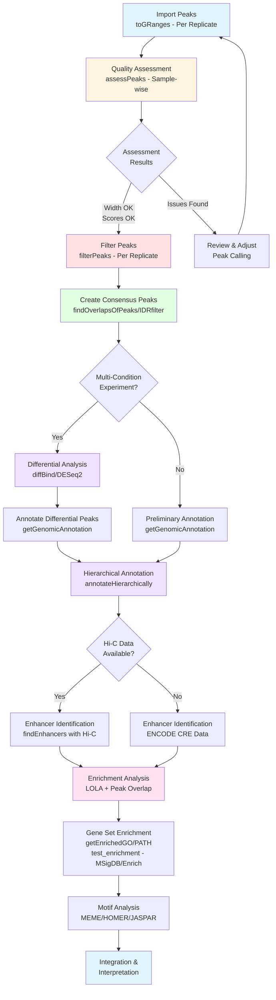
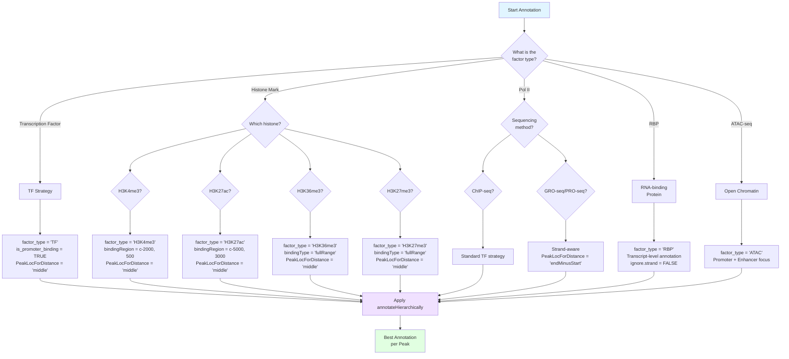
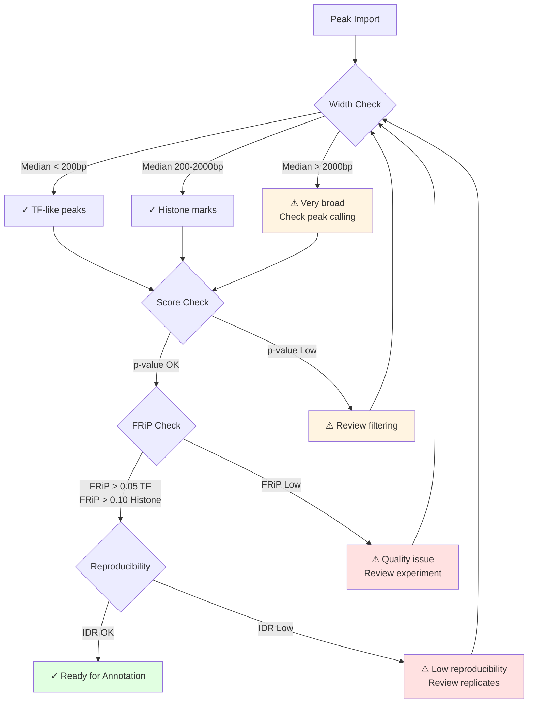
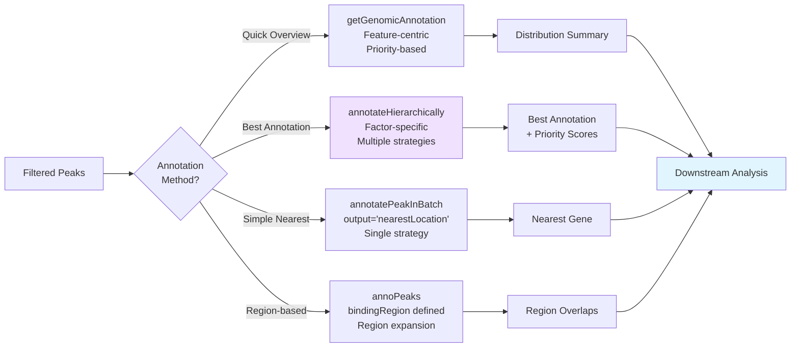

# Peak Annotation Workflow - Visual Diagram

## Complete Workflow Overview



## Detailed Step-by-Step Workflow

```mermaid
graph LR
    subgraph "Phase 1: Per-Replicate Processing"
        A1[Import Peaks<br/>toGRanges - Per Replicate] --> A2[assessPeaks<br/>Sample-wise]
        A2 --> A3[Width Distribution]
        A2 --> A4[Score Metrics]
        A3 --> A5[filterPeaks<br/>Per Replicate]
        A4 --> A5
        A5 --> A6[Filtered Peaks<br/>Per Replicate]
    end
    
    subgraph "Phase 2: Consensus Peak Creation"
        A6 --> B1[findOverlapsOfPeaks<br/>or IDRfilter]
        B1 --> B2[Consensus Peaks<br/>Per Condition]
    end
    
    subgraph "Phase 3: Annotation"
        B2 --> C1{Multi-Condition?}
        C1 -->|No| C2[getGenomicAnnotation<br/>on Consensus Peaks]
        C1 -->|Yes| C3[Differential Analysis<br/>diffBind/DESeq2]
        C3 --> C4[Annotate Differential Peaks<br/>getGenomicAnnotation]
        C2 --> C5[annotateHierarchically]
        C4 --> C5
        C5 --> C6[Best Annotation<br/>per Peak]
    end
    
    subgraph "Phase 4: Enhancer Analysis"
        C6 --> D1{Hi-C Available?}
        D1 -->|Yes| D2[findEnhancers<br/>with Hi-C]
        D1 -->|No| D3[ENCODE CRE<br/>Annotations]
        D2 --> D4[Enhancer-Gene<br/>Associations]
        D3 --> D4
    end
    
    subgraph "Phase 5: Downstream Analysis"
        D4 --> E1[Enrichment Analysis<br/>LOLA + Peak Overlap]
        E1 --> E2[Gene Set Enrichment<br/>getEnrichedGO/PATH<br/>test_enrichment]
        E2 --> E3[Motif Analysis]
        E3 --> E4[Final Results]
    end
    
    style A2 fill:#fff4e1
    style B1 fill:#e1ffe1
    style C1 fill:#f0e1ff
    style D2 fill:#ffe1f0
    style E1 fill:#e1f5ff
```



## Decision Tree for Annotation Strategy Selection



## Quality Control Checkpoints



## Annotation Method Selection Flow



## ASCII Art Workflow (Alternative Format)

```
┌─────────────────────────────────────────────────────────────────┐
│                    PEAK ANNOTATION WORKFLOW                      │
└─────────────────────────────────────────────────────────────────┘

PHASE 1: PER-REPLICATE PROCESSING (Sample-wise)
═══════════════════════════════════════════════════════════════════
    Import Peaks (toGRanges - Per Replicate)
         │
         ▼
    ┌─────────────────┐
    │  assessPeaks()  │  ← Sample-wise assessment
    │  (per replicate)│     Width, Scores
    └─────────────────┘
         │
         ├─── Width Distribution ────┐
         └─── Score Metrics ─────────┘
         │
         ▼
    ┌─────────────────┐
    │  filterPeaks()  │  ← Per replicate filtering
    │  (per replicate)│
    └─────────────────┘
         │
         ▼
    Filtered Peaks (Per Replicate) ✓

PHASE 2: CONSENSUS PEAK CREATION (Per Condition)
═══════════════════════════════════════════════════════════════════
    Filtered Peaks (All Replicates)
         │
         ▼
    ┌──────────────────────────────┐
    │ findOverlapsOfPeaks()        │
    │ or IDRfilter()               │  ← Create consensus
    └──────────────────────────────┘
         │
         ▼
    Consensus Peaks (Per Condition) ✓

PHASE 3: ANNOTATION
═══════════════════════════════════════════════════════════════════
    Consensus Peaks
         │
         ▼
    ┌─────────────────┐
    │ Multi-Condition?│
    └─────────────────┘
         │
         ├─── NO ──► getGenomicAnnotation()
         │            (on consensus peaks)
         │
         └─── YES ──► Differential Analysis
                      (diffBind/DESeq2)
                      │
                      ▼
                   Annotate Differential Peaks
                      (getGenomicAnnotation)
         │
         ▼
    ┌──────────────────────────────┐
    │ annotateHierarchically()     │
    │  - factor_type specified     │
    │  - Multiple parallel         │
    │    strategies                │
    └──────────────────────────────┘
         │
         ▼
    Best Annotation per Peak ✓

PHASE 4: ENHANCER IDENTIFICATION
═══════════════════════════════════════════════════════════════════
    Annotated Peaks
         │
         ▼
    ┌─────────────────┐
    │  Hi-C Available?│
    └─────────────────┘
         │
         ├─── YES ──► findEnhancers(Hi-C data)
         │
         └─── NO  ──► ENCODE CRE annotations
         │
         ▼
    Enhancer-Gene Associations ✓

PHASE 5: DOWNSTREAM ANALYSIS
═══════════════════════════════════════════════════════════════════
    Annotated Peaks (Consensus or Differential)
         │
         ├───► Enrichment Analysis (LOLA + Peak Overlap)
         │
         ├───► Gene Set Enrichment 
         │    (getEnrichedGO/PATH/test_enrichment - MSigDB/Enrich)
         │
         └───► Motif Analysis
         │
         ▼
    Final Integrated Results ✓
```

## Workflow with Time Estimates

```
┌─────────────────────────────────────────────────────────────────┐
│  STEP                    │  FUNCTION              │  TIME      │
├───────────────────────────┼────────────────────────┼────────────┤
│  PER-REPLICATE:           │                        │            │
│  1. Import & Assess       │  assessPeaks()         │  2-5 min   │
│     (per replicate)       │  (sample-wise)         │            │
│  2. Filter                │  filterPeaks()         │  <1 min    │
│     (per replicate)       │  (per replicate)       │            │
│                           │                        │            │
│  PER-CONDITION:           │                        │            │
│  3. Consensus Peaks       │  findOverlapsOfPeaks() │  2-5 min   │
│     (per condition)       │  or IDRfilter()        │            │
│  4. Preliminary Annotation │  getGenomicAnnotation │  3-5 min   │
│     (on consensus)        │                        │            │
│  5. Hierarchical          │  annotateHierarchically│  5-10 min  │
│     (on consensus)        │                        │            │
│  6. Enhancer ID           │  findEnhancers()       │  2-5 min   │
│                           │                        │            │
│  MULTI-CONDITION ONLY:    │                        │            │
│  7. Differential          │  diffBind/DESeq2      │  5-10 min  │
│  8. Annotate Diff Peaks   │  getGenomicAnnotation │  3-5 min   │
│  9. Hierarchical          │  annotateHierarchically│  5-10 min  │
│     (on differential)     │                        │            │
│                           │                        │            │
│  DOWNSTREAM:              │                        │            │
│  10. Enrichment           │  LOLA/Overlap          │  3-5 min   │
│  11. Gene Set Enrichment  │  getEnrichedGO/PATH/   │  3-5 min   │
│                           │  test_enrichment       │            │
│  12. Motif                │  MEME/HOMER            │  10-30 min │
└───────────────────────────┴────────────────────────┴────────────┘

Total Estimated Time: 
- Single condition: 30-65 minutes
- Multi-condition: 45-90 minutes
(depending on dataset size and number of replicates)
```

